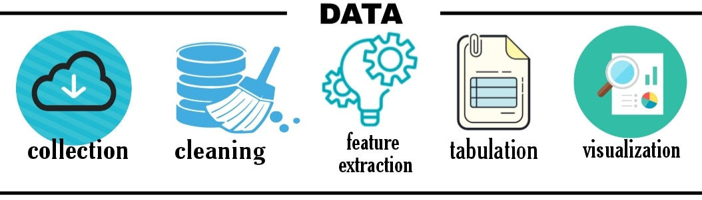

# WhatsApp Chat Analysis
<h2>Frameworks Used</h2>
<ul>
  <li>Pandas</li>
  <li>Numpy</li>
  <li>Plotly</li>
  <li>Streamlit Cloud</li>
 </ul>
A Data Visualization Web Application for doing statistical analysis on whatsapp group chat data. 
<a href="https://share.streamlit.io/akhil-tony/whatapp-chat-analysis/main/finalapp.py">View Live<a>

  <h3>WORK FLOW</h3>

